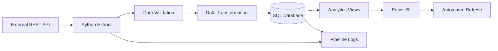

# Automated Data Pipeline & Reporting System

    

## 📌 Project Overview

A production-style **end-to-end automated reporting system** that retrieves product data from a REST API, validates and transforms the data using Python, loads it into a SQL database, creates analytics-ready reporting views, and supports automated Power BI refreshes.

**REST API → Python ETL → SQL Database → Reporting Views → Power BI → Automated Refresh**

The goal is to demonstrate that I can build **repeatable reporting infrastructure**, rather than perform only one-off analysis.

---

## 🎯 Business Problem

A retail/e-commerce reporting team receives product information through an external API. Analysts need a reliable daily view of:

- Product volume
- Category performance
- Pricing
- Customer ratings
- Review activity
- Data-quality issues
- Pipeline execution status

A manual workflow would require repeatedly downloading data, cleaning it, loading it, and refreshing reports.

### Solution

This project automates the complete workflow so the reporting layer can be refreshed consistently with minimal manual intervention.

---

## 🛠️ Skills & Technologies Used

### Programming & Data

- **Python** — ETL, API integration, validation and automation
- **Pandas** — data transformation and preparation
- **Requests** — REST API integration
- **SQLAlchemy** — database connectivity and loading

### SQL & Database

- **SQL** — querying, aggregation and reporting views
- **SQLite** — local development database
- **PostgreSQL-compatible design** — production database extension
- Relational data modeling
- Reporting views
- Data-quality checks

### Business Intelligence

- **Microsoft Power BI**
- Power BI data modeling
- DAX measures
- KPI reporting
- Category analysis
- Data-quality reporting
- Pipeline monitoring dashboard

### Automation & Engineering

- **GitHub Actions** — scheduled pipeline execution
- Environment variables / `.env`
- Retry and timeout handling
- Logging
- Pipeline audit table
- Failure handling
- REST API integration

### Concepts Demonstrated

`ETL` • `Data Validation` • `Data Transformation` • `API Integration` • `SQL Analytics` • `Data Modeling` • `Power BI` • `DAX` • `Automation` • `Monitoring`

---

## 🏗️ System Architecture



### Pipeline Flow

1. **Extract** — Python calls the REST API.
2. **Validate** — required fields, IDs, prices and ratings are checked.
3. **Transform** — raw JSON is normalized into analytics-ready columns.
4. **Load** — transformed records are written to SQL.
5. **Serve** — SQL reporting views prepare data for BI consumption.
6. **Visualize** — Power BI presents KPIs and business insights.
7. **Refresh** — the optional Power BI REST API integration can trigger a dataset refresh.
8. **Monitor** — each run records status, timestamp, row count and errors.

Detailed architecture: [`docs/ARCHITECTURE.md`](docs/ARCHITECTURE.md)

---

## 📊 Power BI Dashboard

The recommended Power BI report contains four pages.

### 01 — Executive Overview

**KPIs**
- Total Products
- Average Price
- Average Rating
- Total Reviews
- Number of Categories

### 02 — Category Analysis

- Product count by category
- Average price by category
- Average rating by category
- Review volume by category

### 03 — Catalog Quality

- Rating bands
- Price bands
- Low-rated products
- Missing/invalid data checks

### 04 — Pipeline Health

- Latest pipeline status
- Last execution time
- Records loaded
- Failed runs
- Error messages

Recommended DAX measures are available in [`powerbi/DAX_MEASURES.md`](powerbi/DAX_MEASURES.md).

---

## 🗄️ Data Model

The reporting layer uses a simple analytics-ready structure:

```text
raw_products
     │
     ├── product_id
     ├── title
     ├── category
     ├── price
     ├── rating
     └── review_count
           │
           ▼
   vw_product_reporting
           │
           ▼
       Power BI
```

The project also maintains a `pipeline_runs` audit table for operational monitoring.

---

## 🔍 Data Quality Checks

Before records are loaded, the pipeline checks:

- Required columns exist
- Product IDs are not null
- Product IDs are unique
- Prices are not negative
- Ratings remain within the expected 0–5 range
- API response has the expected list structure

This prevents invalid API responses from silently reaching the reporting layer.

---

## ⚙️ Automation

GitHub Actions is configured to support:

- Manual execution
- Scheduled execution
- Automated Python environment setup
- Dependency installation
- Pipeline execution

For a production deployment, credentials should be stored using **GitHub Secrets**, not committed to the repository.

---

## 🚀 How to Run Locally

### 1. Clone the repository

```bash
git clone https://github.com/sahzad22/automated-data-pipeline-reporting.git
cd automated-data-pipeline-reporting
```

### 2. Create a virtual environment

```bash
python -m venv .venv
```

Windows:

```bash
.venv\Scripts\activate
```

macOS/Linux:

```bash
source .venv/bin/activate
```

### 3. Install dependencies

```bash
pip install -r requirements.txt
```

### 4. Configure environment

Copy `.env.example` to `.env` and update the values if required.

The default setup uses SQLite and can run locally without installing a database server.

### 5. Run the pipeline

```bash
python -m src.pipeline
```

---

## 📁 Project Structure

```text
automated-data-pipeline-reporting/
│
├── .github/
│   └── workflows/
│       └── pipeline.yml
│
├── src/
│   ├── api_client.py
│   ├── config.py
│   ├── database.py
│   ├── pipeline.py
│   ├── transform.py
│   ├── validate.py
│   └── powerbi_refresh.py
│
├── sql/
│   ├── 01_schema.sql
│   └── 02_reporting_views.sql
│
├── powerbi/
│   ├── DATA_MODEL.md
│   └── DAX_MEASURES.md
│
├── docs/
│   ├── ARCHITECTURE.md
│   └── RUNBOOK.md
│
├── config/
│   └── pipeline_config.json
│
├── data/
│   └── sample_output/
│
├── .env.example
├── .gitignore
├── requirements.txt
└── README.md
```

---

## 💼 Business Value

This project demonstrates how an analyst can move beyond manually prepared Excel reports and build a **repeatable reporting process**.

The architecture reduces manual data-pull work, standardizes transformations, introduces data-quality gates, and provides a consistent reporting layer for Power BI.

---

## 🔮 Production Improvements

Possible enterprise extensions include:

- PostgreSQL / Azure SQL
- Incremental loading using `updated_at`
- Azure Key Vault for secrets
- Azure Data Factory / Microsoft Fabric pipelines
- dbt-based transformations and testing
- Great Expectations data-quality framework
- Teams/email failure alerts
- Power BI Service refresh monitoring
- Data warehouse/star-schema implementation

---

## 📌 Resume Project Description

> **Automated Data Pipeline & Reporting System — Python, SQL, API Integration, Power BI**  
> Built an automated pipeline that retrieves data from a REST API, validates and transforms records using Python, loads them into SQL, creates analytics-ready reporting views, and supports automated Power BI refreshes—demonstrating end-to-end reporting infrastructure and automation.

---

## 👤 Portfolio

**GitHub:** https://github.com/sahzad22
