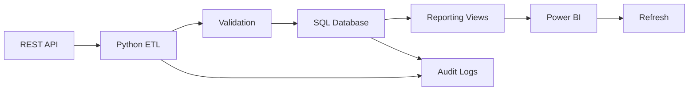

# Automated Data Pipeline & Reporting System

   

> **Python • REST API • SQL • Power BI • Automation**

## Executive Summary

A production-style analytics pipeline that retrieves product data from a REST API, validates and transforms the payload, loads it into SQL, creates analytics-ready reporting views, and can trigger a Power BI dataset refresh.

**REST API → Python ETL → SQL → Reporting Views → Power BI → Automated Refresh**

### Business Scenario

A retail/e-commerce team needs a reliable daily view of its product catalog without manually downloading spreadsheets, cleaning data, or rebuilding reports.

The solution supports product count, pricing, ratings, review trends, category performance, data-quality checks, and pipeline health.

## Architecture



Detailed architecture: [`docs/ARCHITECTURE.md`](docs/ARCHITECTURE.md)

## What This Demonstrates

| Capability | Implementation |
|---|---|
| API integration | REST GET with timeout/retry handling |
| ETL | Python extraction, transformation and load |
| Data quality | Required-field, type, range and duplicate checks |
| SQL | Relational tables and analytics views |
| Automation | GitHub Actions scheduled workflow |
| BI | Power BI-ready reporting model and DAX |
| Monitoring | Pipeline audit table and logs |
| Production thinking | Environment variables and failure handling |

## Power BI Dashboard Concept

Recommended pages:

**01 — Executive Overview**
- Product count
- Average price
- Average rating
- Total reviews
- Category distribution

**02 — Category Analysis**
- Average price by category
- Average rating by category
- Product volume

**03 — Catalog Quality**
- Rating bands
- Price bands
- Products requiring review

**04 — Pipeline Health**
- Latest run status
- Refresh timestamp
- Records loaded
- Failure message

DAX measures are documented in [`powerbi/DAX_MEASURES.md`](powerbi/DAX_MEASURES.md).

## Quick Start

```bash
python -m venv .venv
# Windows: .venv\\Scripts\\activate
# macOS/Linux: source .venv/bin/activate
pip install -r requirements.txt
python -m src.pipeline
```

The default configuration uses SQLite, so the project can run locally without a database server.

## Automation

The repository contains a GitHub Actions workflow that can run the pipeline on demand or on a daily schedule. Production deployments can add database and Power BI credentials through GitHub Secrets.

## Production Extensions

- Incremental loads with `updated_at`
- PostgreSQL/Azure SQL
- Azure Key Vault for secrets
- Airflow / Azure Data Factory orchestration
- dbt / Great Expectations testing
- Teams or email alerts for failed runs
- Power BI Service refresh monitoring

## Resume-ready statement

> Built a Python-based automated reporting pipeline that ingests REST API data, validates and transforms records, loads them into SQL, creates analytics-ready reporting views, and triggers Power BI dataset refreshes—replacing repetitive manual data pulls with a repeatable reporting workflow.
