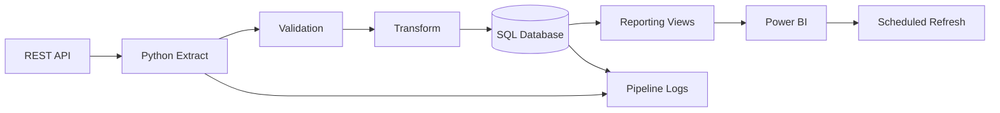

# System Architecture

## End-to-end flow

## Production pattern

**Extract → Validate → Transform → Load → Serve → Visualize → Monitor**

The design separates raw ingestion from reporting logic so that business-facing Power BI queries remain stable even when the upstream API changes.

## Data quality gates

- Required columns present
- Product IDs non-null and unique
- Price values non-negative
- Ratings constrained to 0–5
- API response validated before database load

## Operational monitoring

Every execution writes a pipeline status, timestamp, record count and message to `pipeline_runs`. Failures stop the load and are logged for investigation.
